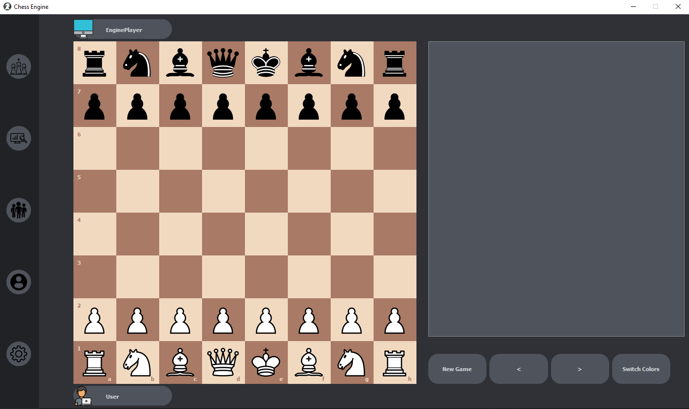

# Chess-Game



Chess Engine made w GUI. Programme will cover the engine itself written in python, gui written in PyQt5. Gui will cover
scene for party analysis, user profile, login screen, players list, settings and of course new game.

Project was not finished due to the performance of the language, lack of motivation to fight for every tear of
performance and lack of time. You can play with engine 1 v 1 as black or white pieces. If you hit `CTRL` button you will
display `FEN` string of current position and if hit `ENTER` you will see current evaluation of position from whites and
blacks
point of view. If you use `New Game` button game will reset to standard position, but if you use `Switch Colors` button
you will change the sides of pieces and `Engine` will make a first move so if you see stutter do not worry.

***

## Table Of Contents

1. [Technology Stack](#technology-stack)
2. [How to install necessary dependencies and Run Code](#how-to-install-necessary-dependencies)
3. [Credits to Authors](#credits-to-authors)
4. [Troubleshooting](#troubleshooting)

***

## Technology Stack

* PyQt 5.15.7,
* Python 3.10,
* Sass 1.54,
* Css 3,
* playsound 1.2.2,
* coverage 6.5.0,
* PyTest 1.7.3,
* mypy 0.982,
* NumPy 1.23.3.

***

## How to install necessary dependencies and Run Code

* First you need to install python for example on linux:

```bash
sudo apt install -y python3
```

* If you want to edit and compile sass files you need to install:

```bash
sudo apt install -y nodejs
npm install -g sass
```

* Lastly install required packages by the chess programme:

```bash
pip install -r requirements.txt
```

* To create this app I used [PyCharm](https://www.jetbrains.com/pycharm/),
* To run this program run script located in:

```bash
Chess-Game/src/main/main.py
```

[Return To Table Of Contents](#table-of-contents)

***

## Credits to Authors

I am not the author of those graphics and sounds and I do not claim the right of ownership over them. I use them just in
educational purposes.

**Chess Icon**

* [Source](https://www.flaticon.com/free-icon/horse_3637390?term=chess&page=1&position=35&page=1&position=35&related_id=3637390&origin=tag),
* [Author](https://www.flaticon.com/authors/freepik),

**User Icon**

* [Source](https://www.flaticon.com/free-icon/programmer_560277),
* [Author](https://www.flaticon.com/authors/freepik),

**Play Icon**

* [Source](https://www.svgrepo.com/svg/169150/chess),

**Analysis Icon**

* [Source](https://www.svgrepo.com/svg/137390/analysis),

**Players Icon**

* [Source](https://www.svgrepo.com/svg/85514/people-hand-drawn-persons-group),

**Profile Icon**

* [Source](https://www.svgrepo.com/svg/315765/profile),

**Engine Icon**

* [Source](https://www.svgrepo.com/svg/3999/computer),

**Settings Icon**

* [Source](https://www.svgrepo.com/svg/13646/settings),

**Chess Pieces**

* [Source](https://commons.wikimedia.org/wiki/Category:SVG_chess_pieces),

**Chess Sound**

* [Source](https://github.com/lichess-org/lila/tree/38bfadac3e319516341771086e8edc594d4d4b07).

[Return To Table Of Contents](#table-of-contents)

***

## Troubleshooting

* **I cannot use code coverage!**

You have to edit `run_coverage.py` from this :

```python
argv = []
for arg in sys.argv:
    if arg.startswith('-m') and arg[2:]:
        argv.append(arg[2:])
    else:
        argv.append(arg)
sys.argv = argv
```

To this :

```python
argv = []
for arg in sys.argv:
    if arg.startswith('-m') and arg[2:]:
        argv.append(arg[2:])
    elif arg.startswith('--omit="'):          ## added two lines
        argv.append('--omit=' + arg[8:-1])    ##
    else:
        argv.append(arg)
sys.argv = argv
```

[Source](https://youtrack.jetbrains.com/issue/PY-48213)

* **I am getting FileNotFoundError with paths.**

The problem is you have bad project settings. If you are using pycharm go to run configuration
and edit `Working Directory` to `<path to Chess-Game>/Chess-Game/src/main` and it will fix this issue.

[Return To Table Of Contents](#table-of-contents)

***
